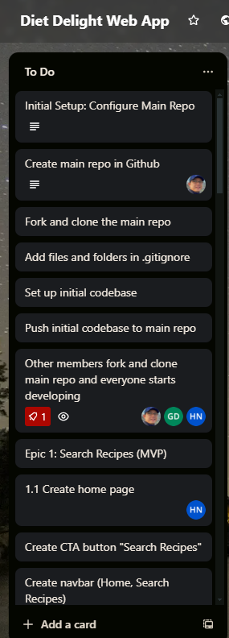
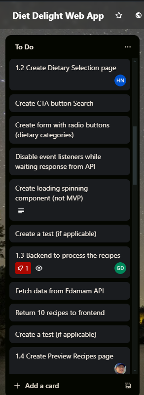
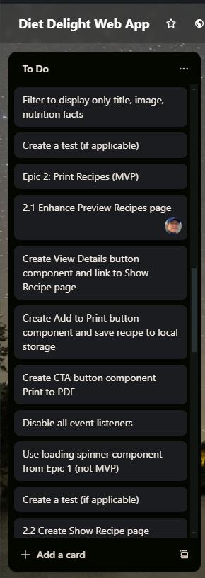
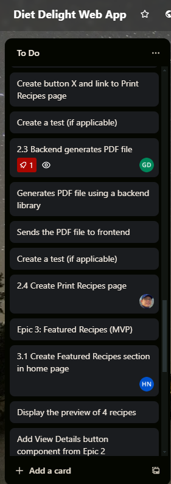
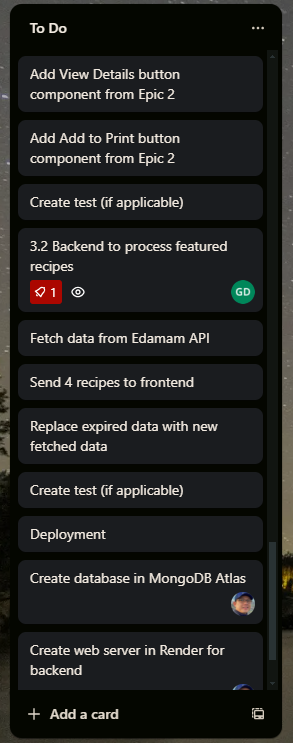

# PartA

## R4	User Stories
### User Registration and Login
* As a new user, I want to be able to register for an account so that I can access the application's features.
* As an existing user, I want to be able to log in to my account securely so that I can access my personalized information.
### Dietary Category Search
* As a user, I want to be able to search for dietary categories (e.g., high-protein, low-carb) based on my fitness goals, so that I can find recipes and meal plans that align with my objectives.
* As a user, I want the search results to be personalized to my fitness goals and dietary preferences, so that I can easily find the most relevant information.
### Recipe Details
* As a user, I want to be able to view detailed information about each recipe, such as the nutrient composition and recommended portion sizes, so that I can make informed decisions about my dietary choices.
* As a user, I want the dietary category details to be presented in a clear and easy-to-understand format, so that I can quickly grasp the key information.
### Meal Planning and Recipes
* As a user, I want to be able to save my favorite dietary categories and recipes, so that I can easily access them for future meal planning.
* As a user, I want to be able to create and save custom meal plans based on my dietary preferences and fitness goals, so that I can easily follow a personalized nutrition plan.
### Mobile Accessibility
* As a user, I want the application to be optimized for mobile devices, so that I can access the features and content on the go, whether I'm at the grocery store, at the gym, or anywhere else.
* As a user, I want the mobile experience to be seamless and intuitive, so that I can easily navigate the application and find the information I need quickly.

## R6 Trello Screenshots
### 14/08/2024

